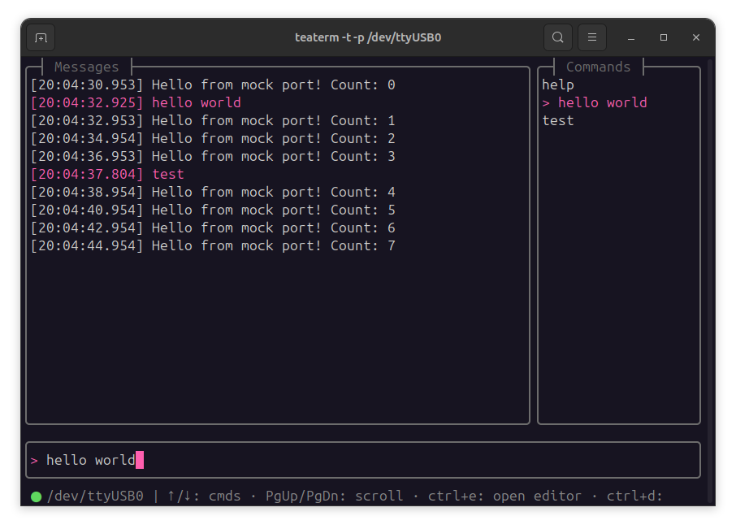

# teaterm - a serial terminal TUI



## Introduction

Teaterm is a simple serial device tool TUI written in GO using the bubbletea framework. It is inspired by tio with a focus on a nice and easy to use user interface.

This version is still very alpha! ;)

## Installation

Teaterm can be installed with go.

```shell
go install github.com/mahlburgc/teaterm@latest
```

## Development

A debug logger can be activated to write debug infos into a log file during teaterm execution.

```shell
git clone https://github.com/mahlburgc/teaterm.git && cd teaterm
export TEATERM_DBG_LOG=1    # enable debug logger
export TEATERM_MOCK_PORT=1  # optional, use a mocked serial port instead of a real one
go run .
```

In a second shell, use tail to see the debug messages.
```shell
tail -f <repo-path>/debug.log
```

## External Editor Support

During a teaterm session you can open an external editor of your choice with the current message log by pressing `ctrl+e`. Make sure your `EDITOR` variable is exported in your shell config file. Otherwise `vim` will be called.

E.g. when using `micro` and `zsh`:

```shell
echo 'export EDITOR="/usr/bin/micro"' >> ~/.zshrc
source ~/.zshrc
```

## Available Features

- list available ports
- easy connection to serial devices
- stable connection with automatic reconnect
- TUI with seperated input, output and command history window
- status bar with current port and connection status
- command history stored over sessions
- mouse support
    - send commands from command history per mouse click
    - scroll message log
- easily open editor with current message log
- timestamp

## Planned features

- configurable port settings
- configurable line ending for RX and TX
- (ability to change config during session)
- status bar shows current port settings (e.g. 9600 8N1)
- create different profiles with separate settings, command histories and predefined commands
- possibility to create predefined commands / favorites for faster communication with serial CLIs
- auto completion suggestions for send commands based on command history
- log to file
- use list bubble for command history for advanced fuzzy finding
- make command history length and message log length configurable
- add scroll bar for message log
- only auto scroll on new messages if we are at lowest line
- indicate that we are on lowest line
- ctrl + page up / down for faster scrolling
- use ctrl+q for quit
- choose between ascii and hex view
- on hex view, ignore non ascii characters
- option to display line ending characters
- use cobra for better cli command handling and flags

## Useful Resources
- https://leg100.github.io/en/posts/building-bubbletea-programs/
- https://github.com/lrstanley/bubblezone
- https://github.com/charmbracelet/bubbletea
- https://github.com/charmbracelet/vhs?tab=readme-ov-file
- https://github.com/spf13/cobra
- https://github.com/charm-and-friends/additional-bubbles?tab=readme-ov-file#additional-bubbles